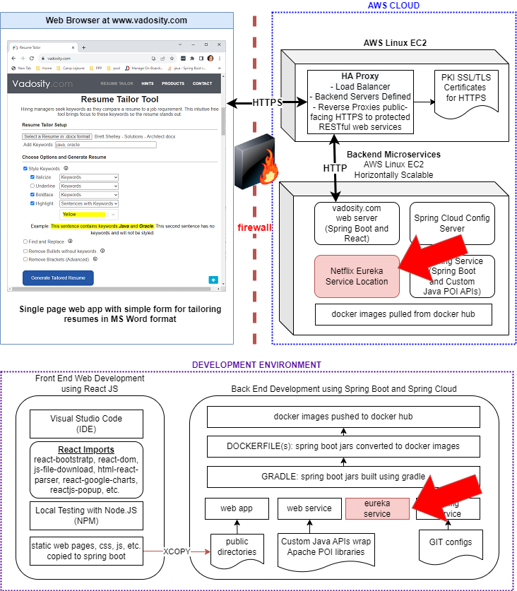

# Spring Cloud Service Discovery with Eureka Server

The red arrows indicate how this project's build artifacts fit into the Resume-Tailor application architecture

</img>

starting the eureka server on windows:

	java -agentlib:jdwp=transport=dt_socket,server=y,suspend=n,address=8003 -jar .\build\libs\eureka-service-1.0.jar

build docker container at project root

	docker build -t resumetailor/eureka-service:1.0 .
	
run docker container in debugging mode 

	docker run -d -p 8761:8761 -p 8003:8003 resumetailor/config-service:1.0	
	
run docker image with access to docker host (localhost)
	
	docker run -d -p 8761:8761 -p 8003:8003 --add-host=host.docker.internal:host-gateway resumetailor/eureka-service:1.0

	
